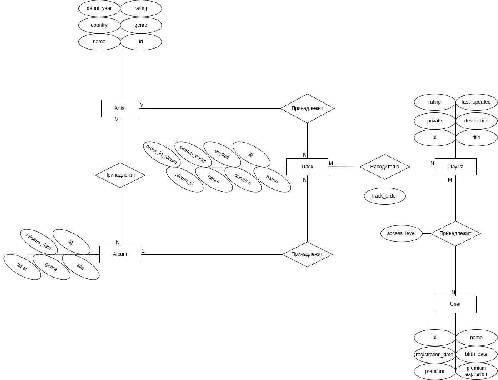

# Orpheon

## Название проекта

Музыкальный сервис `Orpheon`, названный в честь Орфе́я — музыканта и певца из древнегреческих мифов.

## Краткое описание идеи проекта

`Orpheon` — это музыкальный сервис, предоставляющий музыку с открытыми лицензиями *Creative Commons* и *Public Domain*. Пользователи могут свободно слушать, создавать плейлисты, добавлять их в избранное и находить самые популярные моменты треков. Проект ориентирован на пользователей, которым требуется легальная бесплатная музыка для различных целей без риска нарушения авторских прав.

## Краткое описание предметной области

Музыкальные стриминговые сервисы предоставляют пользователям доступ к композициям, однако большинство таких платформ ориентированы на распространение коммерческой музыки, защищённой авторскими правами. Это накладывает ограничения на её использование, особенно для создания контента, коммерческих проектов и публичного воспроизведения. В то же время существует значительный объём музыки, распространяемой по открытым лицензиям, таким как Creative Commons и Public Domain. Такие композиции можно свободно использовать в различных целях, в том числе коммерческих, при соблюдении условий лицензии (при указании авторства). На данный момент наиболее популярные сервисы, предоставляющие музыку только с открытыми лицензиями, функционально уступают сервисам, в которых превалируют коммерческие композиции.

# Краткий анализ аналогичных решений по минимум 3 критериям

Для сравнения также представлены сервисы, предоставляющие музыкальные произведения с коммерческими лицензиями.

| **Критерий**                                  | **Free Music Archive (FMA)** | **Jamendo**               | **Musopen**                      | **Audius**                      | **SoundCloud**                  | **Яндекс.Музыка**             | **Spotify**                  | **Orpheon**                  |
|-----------------------------------------------|-----------------------------|---------------------------|----------------------------------|---------------------------------|---------------------------------|------------------------------|------------------------------|-----------------------------|
| **Доступность в РФ**                          | +                           | +                         | +                                | -                               | +                               | +                            | -                            | +                           |
| **Возможность создания пользовательских плейлистов и управления ими**                       | -                           | -                         | -                                | +                               | +                               | +                            | +                            | +                           |
| **Самые прослушиваемые моменты треков** | -                           | -                         | -                                | -                               | -                               | -                            | -                            | +                           |
| **Лицензии доступной музыки**                  | Creative Commons, Public Domain | Creative Commons, Royalty Free | Public Domain, Creative Commons | Creative Commons | Коммерческая, Creative Commons | Коммерческая, лицензионная музыка | Коммерческая, лицензионная музыка | Creative Commons, Public Domain |

## Краткое обоснование целесообразности и актуальности проекта

Целесообразность проекта объясняется растущей потребностью в музыке с открытыми лицензиями, что особенно важно для создателей контента, которым нужно использовать музыку без нарушения авторских прав. В сервисе будет представлена музыка только с открытыми лицензиями и без авторских прав, что избавит пользователей, таких как видеоблогеры, разработчики игр и маркетологи, от необходимости проверять каждую композицию на тип лицензии. Также будет возможность структурировать композиции в плейлисты и добавлять в избранное уже готовые плейлисты от других пользователей — функция, которая отсутствует в большинстве аналогичных решений, доступных на территории РФ. Сервис будет уникален благодаря функции отображения самых прослушиваемых моментов трека, что позволит пользователям лучше ориентироваться в контенте.

## Краткое описание акторов (ролей)

`Гость` — незарегистрированный пользователь, который имеет ограниченный доступ к функционалу сервиса. Гость может просматривать контент, прослушивать музыку, но не имеет возможности создавать плейлисты или сохранять музыку в избранное.

`Пользователь` — авторизованный пользователь, может прослушивать музыку, создавать свои плейлисты и добавлять публичные плейлисты других пользователей в избранное.

`Пользователь (как владелец плейлистов)` — авторизованный пользователь, имеющий возможность редактирования и удаления плейлистов, владельцем которых он является.

`Администратор` — авторизованный пользователь, основная задача которого заключается в загрузке новых альбомов на платформу и удалении альбомов, треков, публичных плейлистов.

## Use-Case - диаграмма

## ER-диграмма

## Пользовательские сценарии

## Формализация ключевых бизнес-процессов
