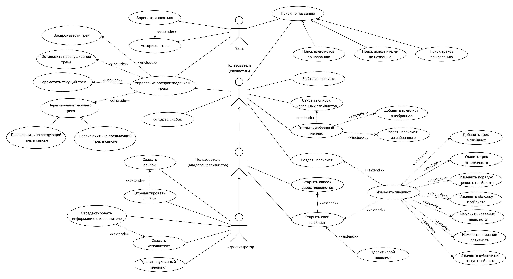
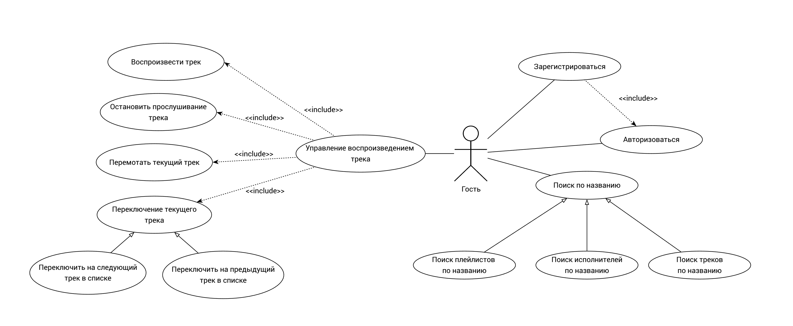
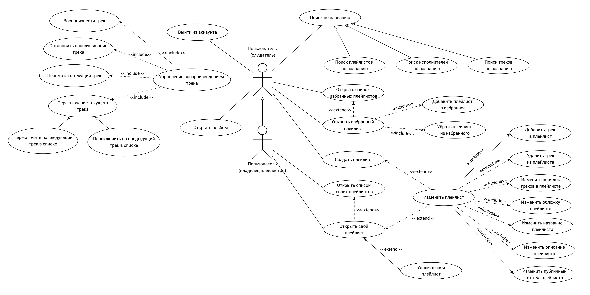
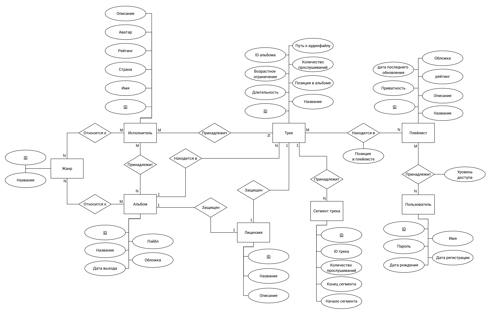
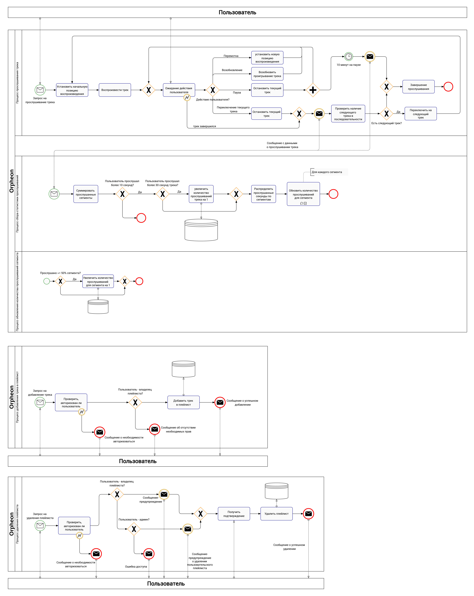
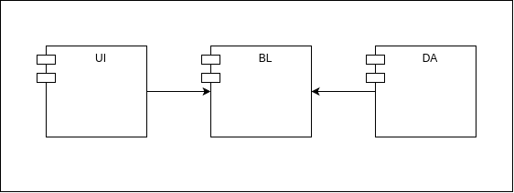

# Orpheon

## Название проекта

Музыкальный сервис `Orpheon`, названный в честь Орфе́я — музыканта и певца из древнегреческих мифов.

## Краткое описание идеи проекта

`Orpheon` — это музыкальный сервис, предоставляющий музыку с открытыми лицензиями *Creative Commons* и *Public Domain*. Пользователи могут свободно слушать, создавать плейлисты, добавлять их в избранное и находить самые популярные моменты треков. Проект ориентирован на пользователей, которым требуется легальная бесплатная музыка для различных целей без риска нарушения авторских прав.

## Краткое описание предметной области

Музыкальные стриминговые сервисы предоставляют пользователям доступ к композициям, однако большинство таких платформ ориентированы на распространение коммерческой музыки, защищённой авторскими правами. Это накладывает ограничения на её использование, особенно для создания контента, коммерческих проектов и публичного воспроизведения. В то же время существует значительный объём музыки, распространяемой по открытым лицензиям, таким как Creative Commons и Public Domain. Такие композиции можно свободно использовать в различных целях, в том числе коммерческих, при соблюдении условий лицензии (при указании авторства). На данный момент наиболее популярные сервисы, предоставляющие музыку только с открытыми лицензиями, функционально уступают сервисам, в которых превалируют коммерческие композиции.

# Краткий анализ аналогичных решений по минимум 3 критериям

Для сравнения также представлены сервисы, предоставляющие музыкальные произведения с коммерческими лицензиями (SoundCloud, Яндекс.Музыка, Spotify).

| **Сервис**              | **Доступность в РФ** | **Возможность создания пользовательских плейлистов и управления ими** | **Самые прослушиваемые моменты треков** | **Отображение лицензии** | **Лицензии доступной музыки**             |
|-------------------------|----------------------|--------------------------------------------------------------------|---------------------------------------|---------------------------|------------------------------------------|
| **Free Music Archive (FMA)** | +                    | -                                                                  | -                                     | +                         | Creative Commons, Public Domain          |
| **Jamendo**              | +                    | -                                                                  | -                                     | -                         | Creative Commons, Royalty Free           |
| **Musopen**              | +                    | -                                                                  | -                                     | +                         | Public Domain, Creative Commons          |
| **Audius**               | -                    | +                                                                  | -                                     | -                         | Creative Commons                         |
| **SoundCloud**           | +                    | +                                                                  | -                                     | +/- *(частично)*         | Коммерческая, Creative Commons           |
| **Яндекс.Музыка**        | +                    | +                                                                  | -                                     | -                         | Коммерческая, лицензионная музыка        |
| **Spotify**              | -                    | +                                                                  | -                                     | -                         | Коммерческая, лицензионная музыка        |
| **Orpheon**              | +                    | +                                                                  | +                                     | +      | Creative Commons, Public Domain          |

## Краткое обоснование целесообразности и актуальности проекта

Целесообразность проекта объясняется растущей потребностью в музыке с открытыми лицензиями, что особенно важно для создателей контента, которым нужно использовать музыку без нарушения авторских прав. В сервисе будет представлена музыка только с открытыми лицензиями и без авторских прав, что избавит пользователей, таких как видеоблогеры, разработчики игр и маркетологи, от необходимости проверять каждую композицию на тип лицензии. Также будет возможность структурировать композиции в плейлисты и добавлять в избранное уже готовые плейлисты от других пользователей — функция, которая отсутствует в большинстве аналогичных решений, доступных на территории РФ. Сервис будет уникален благодаря функции отображения самых прослушиваемых моментов трека, что позволит пользователям лучше ориентироваться в контенте.

Пример аналогичного графика на YouTube:

## Краткое описание акторов (ролей)

`Гость` — незарегистрированный пользователь, который имеет ограниченный доступ к функционалу сервиса. Гость может просматривать контент, прослушивать музыку, но не имеет возможности создавать плейлисты или сохранять музыку в избранное.

`Пользователь` — авторизованный пользователь, может прослушивать музыку, создавать свои плейлисты и добавлять публичные плейлисты других пользователей в избранное.

`Пользователь (как владелец плейлистов)` — авторизованный пользователь, имеющий возможность редактирования и удаления плейлистов, владельцем которых он является.

`Администратор` — авторизованный пользователь, основная задача которого заключается в загрузке новых альбомов на платформу и удалении альбомов, треков, публичных плейлистов.

## Use-Case - диаграмма

### Общая диаграмма

### Диаграмма для гостя (неавторизованного пользователя)

### Диаграмма для авторизованных пользователей

## ER-диграмма

## Пользовательские сценарии

### 1. Прослушивание трека и взаимодействие с плеером

> Актор: Гость

Сценарий:

1. Гость заходит на сайт
2. Переходит на главную страницу со списком популярных треков и/или плейлистов
3. Выбирает интересующий трек или плейлист
4. Нажимает кнопку "Прослушать"
5. Поставил на паузу/нажал кнопку "продолжить"
6. Переключил на предыдущий/следующий трек
7. Перемотал трек на нужный момент (измененил позицию воспроизведения)

> Актор: Авторизованный пользователь

Сценарий:

1. Пользователь заходит в систему и авторизуется
3. Переходит в раздел "Мои плейлисты"
4. Выбирает интересующий плейлист 
4. Нажимает кнопку "Прослушать"
5. Поставил на паузу/нажал кнопку "продолжить"
6. Переключил на предыдущий/следующий трек
7. Перемотал трек на нужный момент (измененил позицию воспроизведения)
8. Добавил трек в другой плейлист

### 2. Создание пользовательского плейлиста

> Актор: Авторизованный пользователь

Сценарий:

1. Пользователь заходит в систему и авторизуется
2. Переходит в раздел "Мои плейлисты"
3. Выбирает опцию "Создать плейлист"
4. Вводит название плейлиста
5. Добавляет описание (по желанию)
6. Загружает обложку плейлиста
7. Добавляет треки из поиска (по названию)
8. Указывает публичный статус плейлиста (приватный/публичный)
9. Сохраняет плейлист

### 3. Загрузка нового альбома в систему

> Актор: Администратор

Сценарий:

1. Администратор авторизуется в системе
2. Переходит в административную панель
3. Выбирает опцию «Добавить новый альбом»
5. Вводит:
    * Название альбома
    * Дату выхода
    * Жанры (один или несколько)
    * Указывает исполнителя(-ей) альбома
6. Добавляет треки в альбом, при этом для каждого трека:
    * Загружает аудиофайл
    * Вводит название
    * Указывает дополнительных исполнителя(-ей) трека
7. Нажимает «Сохранить»

## Формализация ключевых бизнес-процессов

Бизнес-правила:

1. Трек разбивается на сегменты в зависимости от продолжительности трека:

    * 180 секунд (3 минуты) -> длина сегмента составляет 2 секунды.

    * от 180 до 420 секунд (3-7 минут) -> длина сегмента составляет 3 секунды.

    * более 420 секунд (7 минут) -> длина сегмента составляет 5 секунд.

    Для начисления прослушивания для одного сегмента необходимо, чтобы было прослушано 50% секунд этого сегмента.

2. Прослушивание отрезков начисляется при непрерывном прослушивании хотя бы 10 секунд.

3. Прослушивание целого трека начисляется при прослушивании более 30 секунд трека

Бизнесс-процессы в bpmn-нотации:

## Описание типа приложения и выбранного технологического стека

Тип приложения: `Web SPA`

Стек:
* Бэкенд: Golang

* Фронт: React + Typescript 

* БД: PostgreSQL для метаданных, объектное хранилище MinIO для аудиофайлов и изображений

## Верхнеуровневое разбиение на компоненты

## UML диаграммы классов для компонента доступа к данным и компонента с бизнес-логикой

### Сервисы

1. PlaylistService

2. AlbumService

3. 

### Сущности

1. Playlist

2. Album

3. Artist
